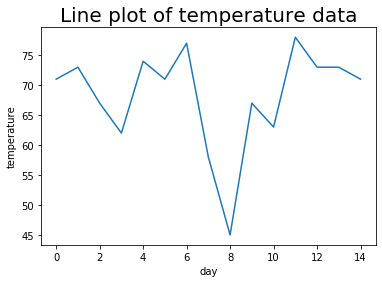
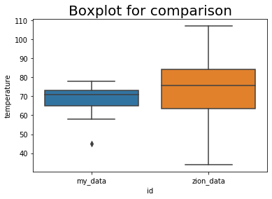

# Descriptive Statistics and Plots:

<hr>

### Step 1: Preparing the dataset
This block of Python code was used to generate the sample data in a Python dataframe that will be used in the calculations later. The task is to use a website to collect the daily maximum temperature data for your city or zip code for the past fourteen days.


```python
# This module will be used to prepare a pandas dataframe and calculate descriptive statistics
import pandas as pd

# input your data in the Python list below. 
# For example, if your temperature data is:  81, 79, 80, 85, 83, 85, 87, 84, 84, 88, 85, 87
# then the step below should be set as:   temperatures = [81, 79, 80, 85, 83, 85, 87, 84, 84, 88, 85, 87]
# temperatures = [Enter your data here]
temperatures = [71, 73, 67, 62, 74, 71, 77, 58, 45, 67, 63, 78, 73, 73, 71]

# prepare a dataframe for temperatures.
temperatures_df = pd.DataFrame(temperatures, columns=['temperature'])

# print temperatures dataframe
print(temperatures_df)
```

        temperature
    0            71
    1            73
    2            67
    3            62
    4            74
    5            71
    6            77
    7            58
    8            45
    9            67
    10           63
    11           78
    12           73
    13           73
    14           71

<hr> 

### Step 2: Calculating descriptive statistics
The block of code below was used to calculate descriptive statistics for the data set. The pandas data frame has several methods that calculate descriptive statistics. The code below will calculate the mean, median, variance, and standard deviation of the temperature data. The code will also use the describe method to calculate several different descriptive statistics.


```python
# Pandas dataframe has several methods that calculate descriptive statistics. 

# mean
mean = temperatures_df['temperature'].mean()
print("Mean=", round(mean,2))

# median
median = temperatures_df['temperature'].median()
print("Median=", round(median,2))

# variance
variance = temperatures_df['temperature'].var()
print("Variance=", round(variance,2))

# standard deviation
stdeviation = temperatures_df['temperature'].std()
print("Standard Deviation=", round(stdeviation,2))

# describe - a useful function that calculates several different descriptive statistics
statistics = temperatures_df['temperature'].describe()
print("")
print ("Describe method")
print (statistics)
```

    Mean= 68.2
    Median= 71.0
    Variance= 72.17
    Standard Deviation= 8.5
    
    Describe method
    count    15.000000
    mean     68.200000
    std       8.495377
    min      45.000000
    25%      65.000000
    50%      71.000000
    75%      73.000000
    max      78.000000
    Name: temperature, dtype: float64


<hr>

### Step 3: Line graph to display trend
The block of code below was used to create a line plot of temperature data. Using the matplotlib.pyplot submodule to create the line chart.


```python
import matplotlib.pyplot as plt

# line chart
plt.plot(temperatures_df['temperature']) # plot

# setting a title for the plot, x-axis and y-axis
plt.title('Line plot of temperature data', fontsize=20) 
plt.xlabel('day')
plt.ylabel('temperature')

# show the plot
plt.show()
```





<hr> 

### Step 4: Side-by-side boxplots to compare distributions
The block of code below was used to create side-by-side boxplots of my temperature data and the temperature data from another location called "Zion". Boxplots can be used to visually compare data distributions. In this code block, I used the seaborn module in Python to create a side-by-side boxplot.


```python
import matplotlib.pyplot as plt
import seaborn as sns
import numpy as np
import random

# creates temperature data for Zion. You don't need to know how this data is created. 
# The temperature data created for Zion will be unique. 
mean = random.randint(temperatures_df['temperature'].min(),temperatures_df['temperature'].max())
std_deviation = random.randint(round(temperatures_df['temperature'].std(),0),round(2*temperatures_df['temperature'].std(),0))
zion_temperatures = np.random.normal(mean, std_deviation, 25)
zion_temperatures = pd.DataFrame(zion_temperatures, columns=['temperature'])

# side-by-side boxplots require the two dataframes to be concatenated and require a variable identifying the data
temperatures_df['id'] = 'my_data'
zion_temperatures['id'] = 'zion_data'
both_temp_df = pd.concat((temperatures_df, zion_temperatures))

# sets a title for the plot, x-axis, and y-axis
plt.title('Boxplot for comparison', fontsize=20) 

# prepares the boxplot
sns.boxplot(x="id",y="temperature",data=both_temp_df)

# shows the plot
plt.show()
```



<hr>